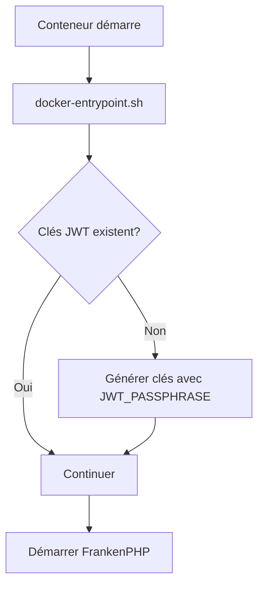

# 🔑 Gestion des Clés JWT

Ce guide explique comment les clés JWT sont gérées dans l'application dockerisée.

## 📋 Stratégie

### Build-time vs Runtime

**Problème** : Les clés JWT nécessitent une passphrase (`JWT_PASSPHRASE`) qui :
- Ne doit PAS être dans l'image Docker (sécurité)
- Est fournie par Infisical au runtime
- Ne peut donc pas être utilisée pendant le build

**Solution** : Génération des clés JWT au runtime, pas au build

## 🏗️ Pendant le Build Docker

### Ce qui se passe :

1. Le répertoire `config/jwt/` est créé vide
2. Les scripts composer sont modifiés pour **ne pas** générer les clés
3. L'image est construite **sans clés JWT**

### Configuration `composer.json` :

```json
"auto-scripts": {
    "cache:clear": "symfony-cmd"
    // lexik:jwt:generate-keypair RETIRÉ du build
}
```

## 🚀 Au Démarrage du Conteneur

### Entrypoint Docker

Un script `docker-entrypoint.sh` s'exécute automatiquement :

```bash
1. Vérifie si les clés JWT existent
2. Si NON : génère les clés avec JWT_PASSPHRASE d'Infisical
3. Si OUI : continue normalement
4. Démarre l'application FrankenPHP
```

### Emplacement du Script

```
frankenphp/docker-entrypoint.sh
```

### Flux d'Exécution



## 🔧 Développement Local

### Première Exécution

```bash
# Démarrer les conteneurs
docker compose up -d

# Les clés sont générées automatiquement au premier démarrage
# Vérifier la génération dans les logs
docker compose logs php | grep JWT
```

### Régénérer les Clés

```bash
# Supprimer les clés existantes
rm -rf config/jwt/*.pem

# Redémarrer le conteneur (les clés seront regénérées)
docker compose restart php

# Ou générer manuellement
docker compose exec php bin/console lexik:jwt:generate-keypair --overwrite
```

## 🚢 Production

### Déploiement Automatique

Le workflow GitHub Actions génère les clés **après** le démarrage des conteneurs :

```yaml
# .github/workflows/deploy-server.yml
- Generate JWT keys with real secrets from Infisical
- docker compose exec php bin/console lexik:jwt:generate-keypair
```

### Déploiement Manuel

```bash
# Sur le serveur après déploiement
cd ~/joypharma

# Les clés sont générées automatiquement par l'entrypoint
# Vérifier
docker compose -f compose.yaml -f compose.prod.yaml exec php \
  ls -la config/jwt/

# Devrait afficher :
# private.pem
# public.pem
```

## 🔐 Sécurité

### Variables d'Environnement Requises

Dans Infisical (environnement `prod`) :

```bash
JWT_PASSPHRASE=votre_passphrase_securisee_unique
JWT_SECRET_KEY=%kernel.project_dir%/config/jwt/private.pem
JWT_PUBLIC_KEY=%kernel.project_dir%/config/jwt/public.pem
```

### Bonnes Pratiques

1. **JWT_PASSPHRASE** :
   - Minimum 32 caractères
   - Caractères aléatoires (lettres, chiffres, symboles)
   - Unique par environnement
   - Stockée uniquement dans Infisical

2. **Clés générées** :
   - RSA 4096 bits (défaut Lexik)
   - Stockées dans `config/jwt/`
   - Ne jamais commiter dans Git (déjà dans `.gitignore`)
   - Régénérées automatiquement si manquantes

### Générer une Passphrase Sécurisée

```bash
# Méthode 1 : OpenSSL
openssl rand -base64 48

# Méthode 2 : PHP
php -r "echo bin2hex(random_bytes(32));"

# Méthode 3 : pwgen
pwgen -s 64 1
```

## 📊 Vérification

### Vérifier les Clés

```bash
# Local
docker compose exec php ls -la config/jwt/

# Production
docker compose -f compose.yaml -f compose.prod.yaml exec php \
  ls -la config/jwt/
```

### Tester l'Authentification JWT

```bash
# Obtenir un token
curl -X POST https://api.votre-domaine.com/api/login \
  -H "Content-Type: application/json" \
  -d '{"email":"user@example.com","password":"password"}'

# Réponse attendue :
{
  "token": "eyJ0eXAiOiJKV1QiLCJhbGc...",
  "refresh_token": "..."
}
```

### Logs de Génération

```bash
# Voir les logs de génération des clés
docker compose logs php | grep -i jwt

# Devrait afficher :
# 🔑 JWT keys not found, generating...
# ✅ JWT keypair generated successfully
```

## 🐛 Troubleshooting

### Erreur : "JWT keys not found"

**Cause** : Les clés n'ont pas été générées

**Solution** :
```bash
# Forcer la régénération
docker compose exec php bin/console lexik:jwt:generate-keypair --overwrite

# Ou redémarrer le conteneur
docker compose restart php
```

### Erreur : "Unable to create the keys directory"

**Cause** : Permissions incorrectes

**Solution** :
```bash
# Créer le répertoire manuellement
docker compose exec php mkdir -p config/jwt
docker compose exec php chmod 755 config/jwt

# Régénérer les clés
docker compose exec php bin/console lexik:jwt:generate-keypair --overwrite
```

### Erreur : "Invalid JWT passphrase"

**Cause** : `JWT_PASSPHRASE` incorrect ou manquant

**Solution** :
```bash
# Vérifier la variable dans Infisical
# Regénérer le .env sur le serveur
infisical export --env=prod --format=dotenv > .env

# Redémarrer
docker compose restart php
```

### Les Clés Sont Régénérées à Chaque Redémarrage

**Cause** : Volume non persistant

**Solution** :
```bash
# Vérifier que config/jwt/ est bien monté
docker compose exec php df -h | grep jwt

# Si nécessaire, ajouter un volume dans compose.yaml
volumes:
  - jwt_keys:/app/config/jwt
```

## 📚 Références

- [Lexik JWT Bundle](https://github.com/lexik/LexikJWTAuthenticationBundle)
- [JWT.io](https://jwt.io/)
- [Infisical Documentation](https://infisical.com/docs)

## 🔄 Migration depuis l'Ancien Système

Si vous aviez des clés JWT existantes :

```bash
# 1. Sauvegarder les anciennes clés
cp config/jwt/private.pem config/jwt/private.pem.old
cp config/jwt/public.pem config/jwt/public.pem.old

# 2. Supprimer les anciennes clés
rm config/jwt/*.pem

# 3. Définir JWT_PASSPHRASE dans Infisical

# 4. Redémarrer (nouvelles clés générées automatiquement)
docker compose restart php

# 5. Les anciens tokens JWT ne fonctionneront plus
# Les utilisateurs devront se reconnecter
```

---

**🔐 Sécurité et Automatisation pour vos Clés JWT ! 🔐**

